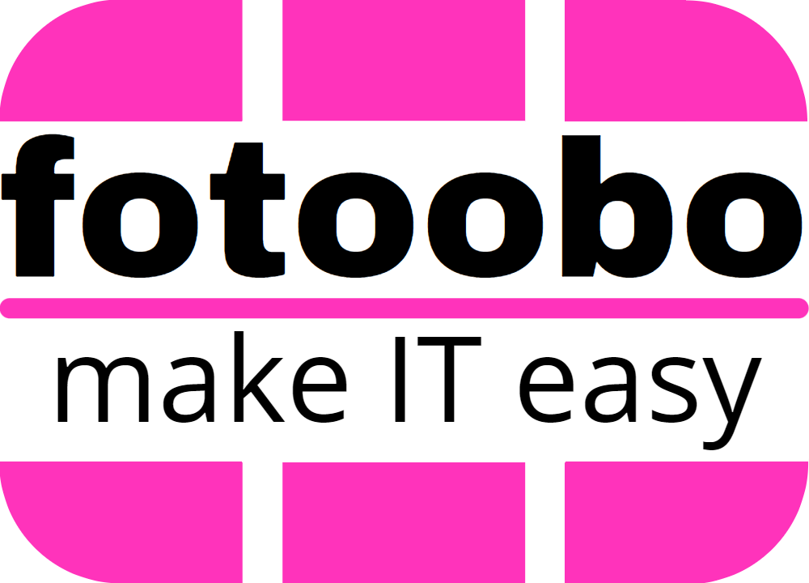

.. fotoobo documentation master file
  You can adapt this file completely to your liking, but it should at least contain the root
  `toctree` directive.

The fotoobo documentation
=========================

This is fotoobo, the mighty **Fo**\ rtinet **too**\ l\ **bo**\ x for managing your Fortinet
environment. The tool consists of several useful utilities with functionality which is not covered
by the standard Fortinet management suite. It is meant to be extendable to your needs. So feel free
to add or update the utilities as needed but please be aware that there are some guidelines on how
to `contribute <https://github.com/migros/fotoobo/blob/main/CONTRIBUTING.md>`_ to the development.

.. toctree::
  :maxdepth: 1
  :caption: User Documentation

  usage/getting_started
  usage/configuration
  usage/inventory
  usage/convert

.. toctree::
  :maxdepth: 1
  :caption: Developer Documentation
  
  developer/c4
  developer/package_structure
  developer/fortinet/classes
  code
   

Changelog
---------

The changelog for this project is maintained in the repository and can be found here:
`<https://github.com/migros/fotoobo/blob/main/CHANGELOG.md>`_

Indices and tables
------------------

* :ref:`genindex`
* :ref:`modindex`

License
-------

fotoobo is licensed under the `LGPL v3 <https://www.gnu.org/licenses/lgpl-3.0.html.en>`_.

Since it is a python application which does not compile to a binary before distribution, we want to
clarify the following:

* fotoobo may be used as an imported module under the same terms that the LGPL states for
  dynamically linked (binary) libraries. So you may use fotoobo (unmodified) with code under another
  license (free or commercial).
* All changes to the fotoobo code itself are subject to the LGPL v3.

Built with
----------

* `Python <https://www.python.org/>`_
* `Poetry <https://python-poetry.org/>`_
* `Typer <https://typer.tiangolo.com/>`_
* `Tox <https://tox.wiki/en/latest/>`_
* `Sphinx <https://www.sphinx-doc.org/>`_ 
  with `Autodoc <https://www.sphinx-doc.org/en/master/usage/extensions/autodoc.html>`_
* `Jinja2 <https://palletsprojects.com/p/jinja/>`_
* and some more

Authors
-------

* `Patrik Spiess <patrik.spiess@mgb.ch>`_
  (`Migros Genossenschafts Bund <https://www.migros.ch/>`_)
* `Lukas Murer <lukas.murer@mgb.ch>`_
  (`Migros Genossenschafts Bund <https://www.migros.ch/>`_)
  (`onway <https://www.onway.ch/>`_)

Sponsors
--------

The main work for fotoobo is done by Fortinet enthusiasts at Migros Genossenschafts Bund,
Switzerland. Thanks for the time and effort we are able to spend to this project in our daily work.

